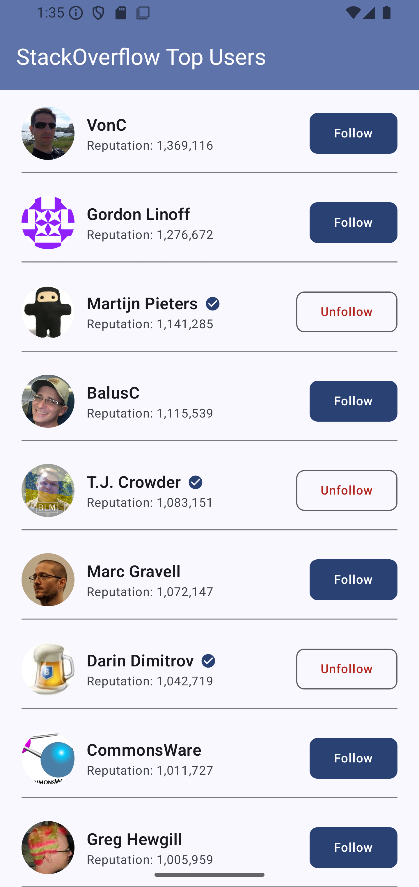

# StackUsers

Android application that fetches a list of StackOverflow users and displays it in a
list on the screen

## Features

- Displays the top 20 StackOverflow users sorted decrementally by reputation.
- Each entry shows the user's profile image, display name, and reputation score
- Follow and unfollow a user. Status is stored locally and no API call is made.
- Followed users are marked with a tick next to their name.
- Follow status persists across app restarts using Jetpack DataStore
- Error state with retry option is displayed when the server is unreachable or returns an error
- Fully localised UI strings

## Preview

## Architecture

The app follows **Clean Architecture** with **MVVM** in the presentation layer, organised into three distinct layers with strict dependency rules: outer layers depend on inner layers, never the reverse.

**Presentation**-> ViewModels, Compose screens, UI state
**Domain**      -> Use cases, repository interfaces, models
**Data**        -> Retrofit, DataStore, repository implementations

### Why Clean Architecture over plain MVVM?

Plain MVVM let ViewModels to reach directly into data sources, thereby making business logic hard to test independently. 
Clean Architecture solves this by introducing a **domain layer** of pure Kotlin with no Android dependencies or framework imports. 
Use cases can be unit tested without mocks of Android dependencies.

The domain layer also owns the `UsersRepository` **interface**, meaning the data layer is a plug-in detail. 
The ViewModel never knows whether data comes from the network, a cache, or a test double.

